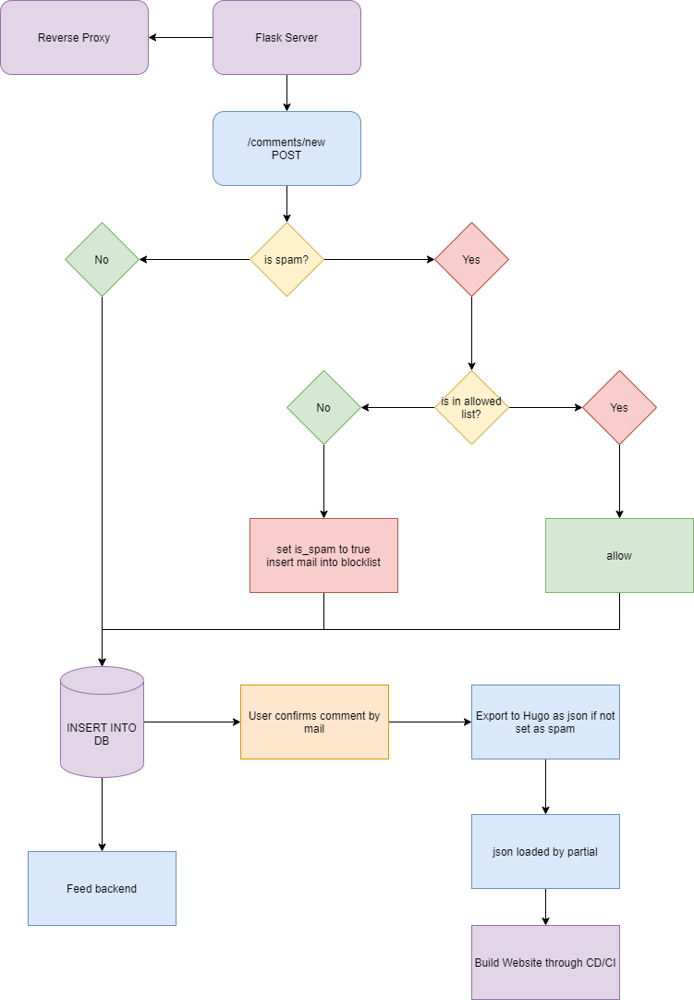

# Labertasche

A comment system for Hugo, written in Python (and Javascript).

## Feature Set

* Written in Python, utilizing Flask
  * Robust Database handling by utilizing SQLAlchemy, which supports all big database engines
  * flask-cors for robust security
* Uses Javascript to send comment via POST to the comment server
  * Has callbacks for implementing your own notifications during the posting process.
* No IP being logged
* Email confirmation 
* EMail Blocklist 
* Only outputs JSON, so templates can be done independently, enhancing customization. Using the comments via a partial
  template in Hugo is the recommended way. See below for integration code.
* Antispam
* Email Validation

## Requirements

* A public webserver capable of running Python, Apache/NGINX and/or gunicorn. This server does not need to be the same as the 
  server running the site, but it must have access to your CI/CD chain. Same server is of course easier to implement.
  
## Dependencies
  
* Python 3.8  
    * flask
    * flask-cors
    * flask-sqlalchemy
    * flask-login
    * antispam
    * pyyaml
    * requests
    * py3-validate-email
* Recommended OS: Ubuntu 20, Debian Buster    
* Recommended Server Software: Apache with libmodwsgi for Python 3
* GoHugo, but the json can also be used by Javascript and other languages

## How does it work?

A picture often says more than a thousand words:



In some words, the user sends the comment from your site to the comment system, the comment system does the validation
and confirmation. Then, a json is put into the data directory from where you can load it via Hugo and generate your 
template.

## Setup

Run `git clone ssh://git@git.tuxstash.de:1235/gothseidank/labertasche.git` in the directory where you wish to host the comment 
system. For example, `/var/www/html`, I also recommend making use of `/srv/` or `/opt/`. It depends on you.

When everything is downloaded, create the directory `/etc/labertasche`. In this directory, we need 2 files:

* labertasche.yaml - you can find an example in the root directory.
* mail_credentials.json - you can find an example in the root directory.

Copy these files from the root directory of this app to the folder `/etc/labertasche`. Make sure to set ownership for 
your user that runs your server later. I always do `chown user:www-data`, so Apache has only group rights and enable read-only 
for the Apache user. I also recommend `chmod 700` for the directory and `chmod 600` for the files.

Make sure to read the config and replace the values as needed. The mail configuration should need no explanation,
`labertasche.yaml` has comments. Feel free to bug me about more documentation regarding this. Pay special attention to 
secrets and passwords.

Now, for the server there are several options. I personally always host flask apps with Apache and libmodwsgi. 
The config looks like this:

* [Apache](docs/apache-config.md)

Other options:

* [gunicorn](https://gunicorn.org/https://gunicorn.org/) + Apache/Nginx with Proxy Pass

Once you can see the administrative page, you can start integrating it into Hugo.

## Integrating it into Hugo

### Javascript

In the project folder is a small javascript file. You will need to add this to Hugo. I suggest using Hugo's asset 
pipeline to integrate it into your site and merge it with your current javascript. 
One thing is important to know: this script only does the bare bones post request to the comment backend. 
Anything else must be done by yourself, such as messages about minimum length etc. 
But don't worry: The function is making use of a callback, where you can receive various messages with error codes
and act on them. See the javascript file for an example callback. 

### Hugo templates

Remember the `labertasche.yaml` file? It asked you where the data folder of Hugo is. What this program does, is to place
various json files into that folder, in folders that describe your sections. So, for each category/section of your blog
where comments can be placed, one folder will be made. And for each page within that section it generates a json file.

Now create a new [partial](https://gohugo.io/templates/partials/) called "comments.html" (or something else). 
Within that template the following structure is needed:

```
{{ $location := .Scratch.Get "location" }} 
{{ if (fileExists $location ) }}
    {{ $dataJ := getJSON  $location }}
        {{ range $dataJ.comments }}
                   
        {{ end }}
{{ end }}
```

This loads the json depending on the rel url and walks the list of comments. You can then use the following variables to 
access the per-comment data:  

* .content      => The body of the message the user has sent
* .email        => The mail the person used to send the mail
* .created_on   => The date and time the comment was posted
* .comment_id   => The comment id, great for making anchors
* .gravatar     => The md5 hash of the mail for gravatar, if caching is on, prepend e.g. `/images`, otherwise use the gravatar url to integrate it.

You can style around them as needed. You have free reign. 

Of course you will also need a few inputs and a button that submits the data.
Here is a base skeleton to start out:

```
<div>
    <input type="text" maxlength=100 placeholder="Enter Email" id="labertasche-mail">
    <textarea cols="10" rows="10" id="labertasche-text"></textarea>
    <input type="button" onclick="labertasche_post_comment(this, labertasche_callback);">
</div>
```

Please take note of the `id` on each element, these are mandatory, as well as the function call for the `onclick` event.
Again, style as needed and add more Javascript to your gusto. Make sure to implement the callback, otherwise the 
Javascript will crash.

Inside your template `single.html`, or wherever you want to place comments, you will also need this:
 
``` 
{{ $file := replaceRE "^(.*)[\\/]$" "data$1.json" .Page.RelPermalink }}
{{ .Scratch.Set "location" $file }}
{{ partial "partials/comments" . }}
```
There is no styling needed for this part!
 
After that and configuring labertasche correctly, the json files should be placed in your data folder and all you got
to do after that, is to rebuild Hugo and the new comment should appear. 

## Watching for changes via systemd

Hugo accepts the `--watch` command without the `server` option:    
`hugo --watch` is valid and it will watch the directory and rebuild the files, if something changes. 
Knowing that, we can build a systemd service from that, which could look like this:

```
[Unit]
Description=Hugo
After=syslog.target
After=network.target

[Service]
RestartSec=2s
Type=simple
User=www-data
Group=www-data
WorkingDirectory=/var/www/html/
ExecStart=/usr/local/bin/hugo --watch --minify --noChmod --cleanDestinationDir --gc
Restart=always

[Install]
WantedBy=multi-user.target
```

`-noChmod` is a very important switch for this, because it stops Hugo from adjusting the file permissions.
This comes in handy if you have a difference in user and group on your web server. `--cleanDestinationDir` and `--gc` 
will clean old files out, so you don't have to worry about synching the public directory with the current content of
your static or assets dir. There will also be no old CSS files be lying around when using fingerprinting.

<!--suppress HtmlDeprecatedAttribute -->
<p align="center">
<a href='https://ko-fi.com/L3L31HXRQ' target='_blank'></a>
</p>
